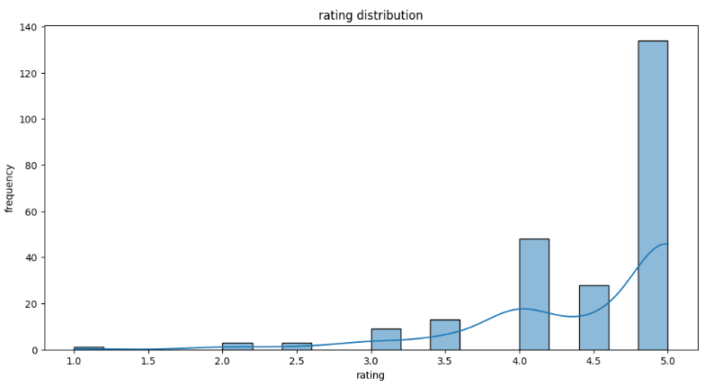
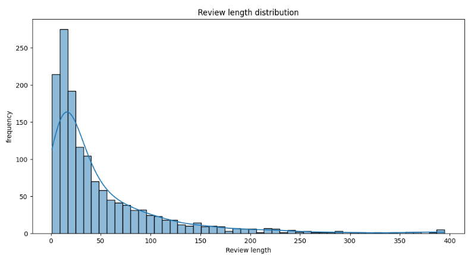
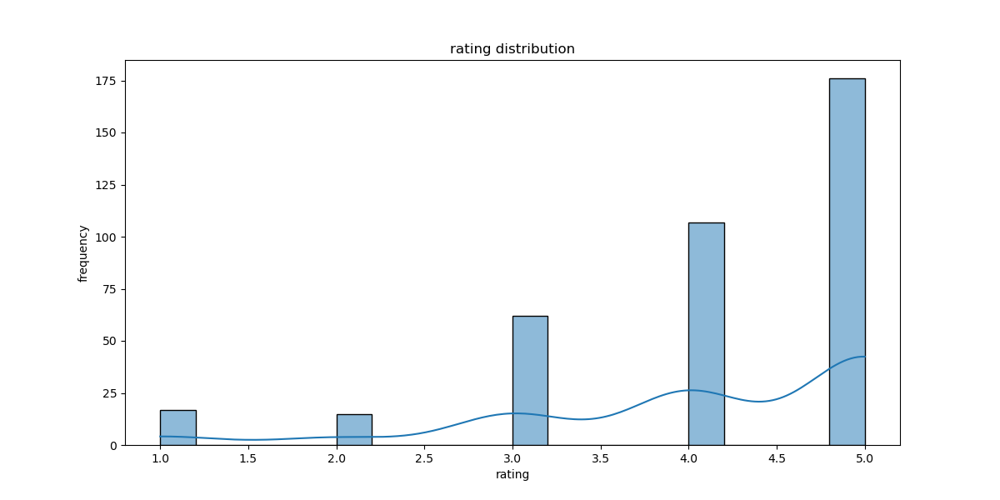
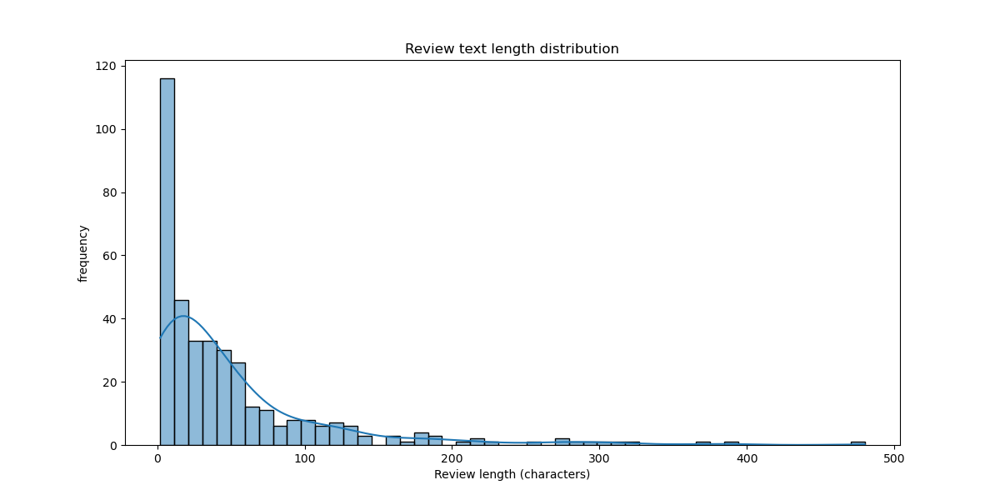
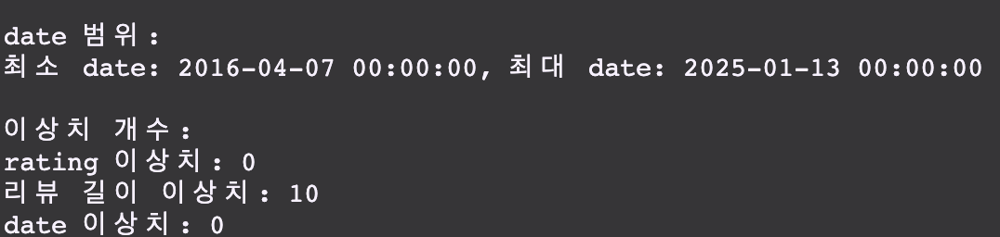
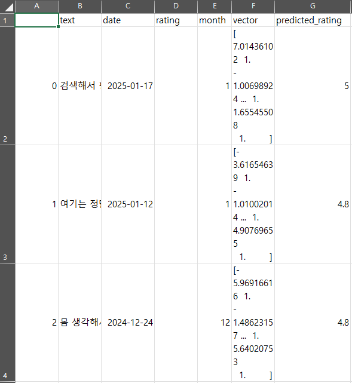
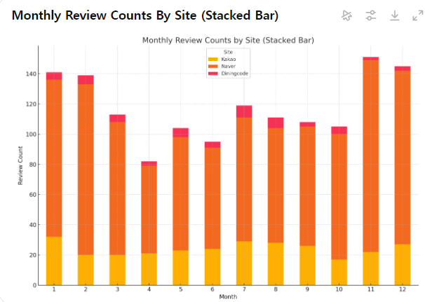
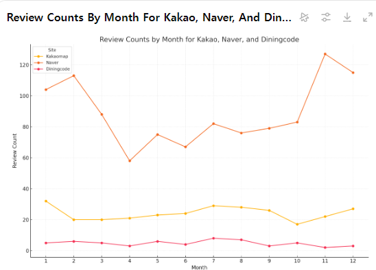

# 🛠️ 베이스라인즈 (BaseLines)팀 팀원 자기소개 🛠️

---

## 🐍 김현운

- **학과:** 응용통계학과 23학번
- **지원:** DA
- **자기소개:**  
  백준을 한 문제도 풀어보지 않았던 코린이지만, 앞으로 열심히 노력하여 팀에 도움이 되고자 합니다!  
  방학 스터디에서는 **시각화**와 **교육세션 복습**을 신청했습니다.
  - **교육세션 복습:** 첫 수업에서 느낀 어려움을 극복하고자 신청.
  - **시각화:** 태블로와 맷플롯립(Matplotlib)을 통해 데이터와 분석 결과를 시각화하는 기술을 배우고 싶습니다.
- **각오:** 부족하지만 열심히 공부해서 팀에 누가 되지 않도록 따라잡겠습니다!

---

## ⚾ 성우제

- **학과:** 산업공학과 19학번
- **지원:** DA
- **자기소개:**  
  데이터 분석가로서의 커리어를 목표로 DA팀에 지원했습니다.  
  팀원들과 함께 성장하며 데이터 분석 역량을 키우고 싶습니다!
  - **특이사항:** 야구를 굉장히 좋아합니다. 🧢⚾
- **각오:** DA팀 활동을 통해 데이터 분석의 기초를 탄탄히 다지고 싶습니다.

---

## 🎸 김정인

- **학과:** 컴퓨터과학과 24학번
- **지원:** DE, DS (공동 1순위)
- **자기소개:**  
  다양한 경험을 하고 싶어 DE와 DS 분야에 공동 지원했습니다.
  - **취미:** 야구 ⚾, 축구 ⚽, 락뮤직 🎵
- **각오:** 팀 활동을 통해 다양한 지식과 기술을 배우고, 성장의 발판을 마련하고 싶습니다.

---

### 🙌 함께 성장하는 베이스라인즈 (BaseLines)팀이 되길 기대합니다!

<div style="display: flex; justify-content: center; align-items: center; gap: 20px;">
    
    
    
    
    
</div>

# YBIGTA Newbie Team Project 실행 방법

## 설치 방법

1. **Python 버전 확인**  
   Python 3.7 이상(또는 프로젝트에서 권장하는 버전)을 사용 중인지 확인합니다.

2. **가상 환경(옵션)**  
   원활한 패키지 관리를 위해 가상 환경 사용을 권장합니다.

   ```bash
   # 가상환경 생성 예시
   python -m venv venv
   source venv/bin/activate  # Mac/Linux
   # 또는 venv\Scripts\activate  # Windows

   ```

3. **프로젝트 종속 라이브러리 설치**  
   프로젝트 루트 디렉토리(`YBIGTA_newbie_team_project`)에서 다음 명령어를 실행합니다.
   ```bash
   pip install -r requirements.txt
   ```
4. 실행 방법
   **Uvicorn을 사용한 실행**  
   가장 간단한 실행 방법은 uvicorn 명령어를 이용하는 것입니다.
   ```bash
   uvicorn app.main:app --reload --host 0.0.0.0 --port 8000
   ```
   - `app.main:app`은 `app` 폴더 내부의 `main.py`에서 FastAPI 인스턴스가 `app`이라는 이름으로 선언되어 있음을 가정합니다.
   - `--reload`는 개발 편의를 위해 코드 변경 시 자동으로 서버를 재시작합니다.
   - `--host`와 `--port`는 원하는 IP 주소와 포트를 지정할 수 있습니다(기본은 `127.0.0.1:8000`).


# NaverCrawler

이 프로젝트는 네이버 리뷰 데이터를 크롤링하여 CSV 파일로 저장하는 Python 기반의 크롤링 도구입니다. Selenium과 BeautifulSoup을 활용하여 데이터 수집 및 처리 과정을 자동화합니다.

---

## 데이터 소개
- **크롤링한 사이트**: [네이버 지도 리뷰 페이지](https://map.naver.com/p/entry/place/21306384?c=15.00,0,0,0,dh&placePath=/review)
- **데이터 형식**: 
- `text` (리뷰 내용, 문자열)
- `date` (작성 날짜, `YYYY-MM-DD` 형식의 문자열)
- `rating` (별점, 문자열 또는 숫자)  # 별점의 경우 네이버리뷰는 2021년 10월부터 폐지. 따라서 그 이후의 리뷰들은 별점이 없음.
- **데이터 개수**: 수집 가능한 모든 리뷰 (사이트 내 더보기 버튼을 통해 스크롤) - 1429개

---

## 실행 방법

### 1. 가상환경 설정 및 종속성 설치
1. Python 가상환경 생성:
   ```bash
   python -m venv myenv
   source myenv/bin/activate  # Windows에서는 myenv\\Scripts\\activate
   ```
2. 필요한 패키지 설치:
   ```bash
   pip install -r requirements.txt
   ```

### 2. 크롤러 실행
1. main.py 실행:
   ```bash
   PYTHONPATH=. python ./review_analysis/crawling/main.py -d database -c Naver  # -c Naver 대신 -a 실행도 가능
   ```
2. 크롤러는 네이버 리뷰 데이터를 자동으로 수집하고 지정된 `output_dir`에 저장합니다.

---

## 결과물
- **결과 파일**: `reviews_naver.csv`
- **파일 위치**: `./database/` 디렉토리 (코드에서 설정 가능)
- **데이터 샘플**:
   ```csv
   text,date,rating
   "맛있어요",2023-01-01,"5"
   "서비스가 별로에요",2023-01-02,"2"
   ```

---

# 네이버 EDA/FE/텍스트

## 별점 분포

- 4~5점 리뷰의 개수가 가장 많음
- 네이버의 경우 2021년 10월부터 별점 시스템을 폐지했음. 따라서 사진에서 보이는 별점들은 그 이전의 리뷰들에서 수집한 별점들임.
- 0부터 5까지 0.5 단위로 존재

## 연도별 리뷰 개수 분포

- 2019년부터 2025년까지의 리뷰들이 수집되었으며, 2023, 2022, 2024 순으로 가장 많았음.

## 리뷰 길이 분포

- 0~100자 이내의 리뷰가 가장 많았음.
- 0자인 리뷰는 확인 결과 1개 있었음. 이것은 제외했음.

## reviews_naver.csv 전처리 및 FE
1. 결측치 처리
- 리뷰 내용이 없는 리뷰는 총 1개로, 제거해줬음
- 별점의 경우 네이버는 별점 서비스가 중단된 상태이므로, 별점이 있는 리뷰와 없는 리뷰를 나누어서 각각 csv파일로 저장
- 날짜가 없는 리뷰도 제거하려 했으나, 날짜가 없는 리뷰는 없었음

2. 이상치 처리
- 별점의 경우 0점 이상 5점 이하의 별점만 유효하므로 그 외의 별점을 지닌 리뷰는 제거하기로 함.(해당하는 리뷰 0개였음)
- 1개 이하의 단어로 이루어진 리뷰는 이상치로 판단하고 제거하기로 함

3. FE
- 추후 진행할 시계열 분석의 용이성을 위해 날짜에서 월만 추출하여 month 열을 새롭게 생성했음
- 한국 comment에 fine tuning된 BERT인 KcBERT를 통해 리뷰 텍스트를 벡터화했음. 이를 vector라는 열에 할당해주었음.

---
## KaKao EDA/전처리/FE

<div style="display: flex; justify-content: center; align-items: center; gap: 20px;">
   
   
</div>

분석 결과를 바탕으로 데이터의 특성과 이상치에 대해 설명드리겠습니다:

1. Rating (평점) 특성:

- 총 377개의 평점 데이터 존재
- 평균 평점은 약 4.09점으로 상당히 높은 수준
- 표준편차는 1.09로 평점의 변동성이 크지 않음
- 평점 분포는 4점에 집중되어 있음 (25%, 50% 모두 4점)
- 최소 1점에서 최대 5점까지 분포
- 대부분의 리뷰가 4-5점 사이에 집중되어 있어 긍정적인 평가가 많음

2. 리뷰 길이 특성:

- 총 377개의 리뷰 길이 데이터
- 평균 리뷰 길이는 약 50자
- 표준편차가 65.67로 리뷰 길이의 편차가 큼
- 최소 2자에서 최대 480자까지 wide range
- 중앙값(50%)은 29자로, 대부분의 리뷰는 상대적으로 짧은 편
- 리뷰 길이 분포가 매우 비대칭적

3. 이상치 분석:

- Rating 이상치: 없음
- 리뷰 길이 이상치: 10개 존재
- Date 이상치: 없음

4. 날짜 범위:

- 최소 날짜: 2016-04-07
- 최대 날짜: 2025-01-13 (미래 날짜 포함)

주목할 만한 점:

- 리뷰 길이의 높은 표준편차는 리뷰 길이가 매우 다양함을 의미
- 10개의 리뷰 길이 이상치는 추가 조사가 필요할 수 있음

5. 결측치 처리:

- 초기 리뷰 수에서 결측치 제거
- 'text', 'rating', 'date' 열의 결측치 제거
- '내용 없음' 리뷰 제거
- 한 단어로 된 리뷰 제거

6. 이상치 및 데이터 정제:

- 별점 범위 필터링 (0~5점)
- 별점 정수형 변환
- 날짜 형식 통일 ('.'->'-)
- 날짜 끝 '-' 제거

7. 텍스트 데이터 전처리:

- KcBERT 모델 사용
- 텍스트 토큰화 (최대 길이 128)
- [CLS] 토큰 임베딩 추출

8. 파생변수 생성:

- 'month' 컬럼 추가 (리뷰 작성 월)
- 'vector' 컬럼 추가 (텍스트 벡터화 결과)

9. 벡터화 방식:

- 배치 처리 (배치 크기: 32)
- GPU 사용 (가능한 경우)
- 벡터 길이: 모델 은닉층 차원

최종 결과: 정제된 리뷰 데이터셋 생성, CSV 파일로 저장
=======


# 텍스트 비교 분석 : KNN을 활용한 별점 없는 네이버 리뷰의 별점 예측 모델

1. 카카오, 다이닝코드, 구글맵스, 네이버리뷰(별점 있는 것)의 리뷰 텍스트를 KcBERT를 통해 텍스트 벡터화
2. KNN 모델 학습
3. K=5로 해서 별점이 없는 네이버리뷰의 별점을 예측 => ./database/Test_Dataset_with_Predicted_Ratings.csv


---

# 시계열 분석 : 월별 리뷰 개수 추이

- 모든 리뷰를 월별로 그룹핑하여 월별 리뷰 개수 추이를 분석
- 1,2, 11, 12월에 전체적인 리뷰 개수가 가장 많았음
- 파이가 겨울 간식..인가..?


- 크롤링된 리뷰 개수는 네이버 - 카카오 - 다이닝코드 순
- 카카오와 네이버는 1월, 12월에 가까울수록 비교적 리뷰 개수 많은 것으로 보임
- 다이닝코드는 리뷰 수도 많지 않고 추세도 평탄함

