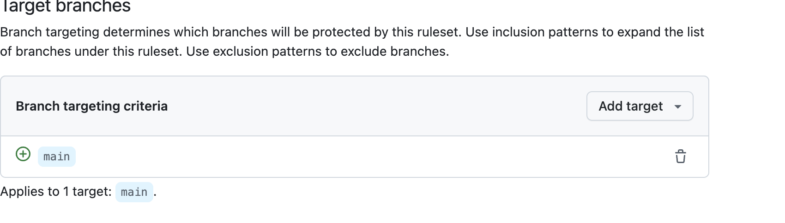
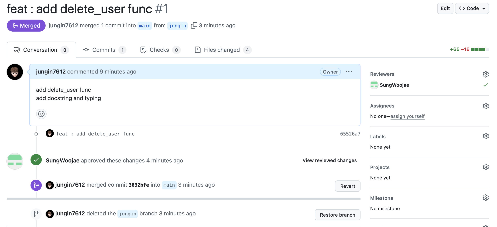
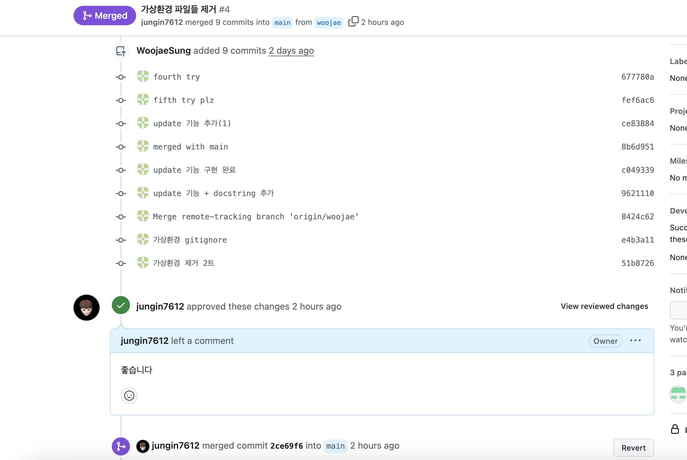
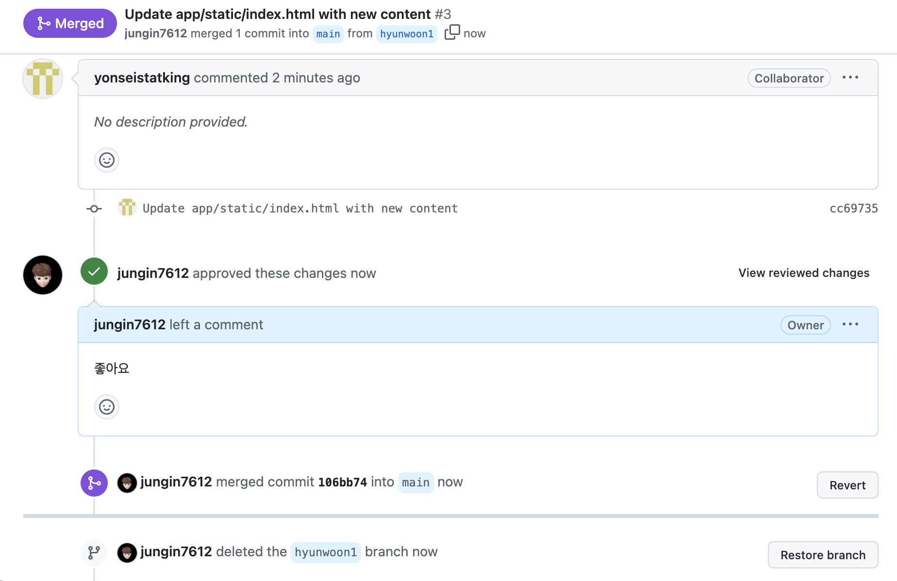
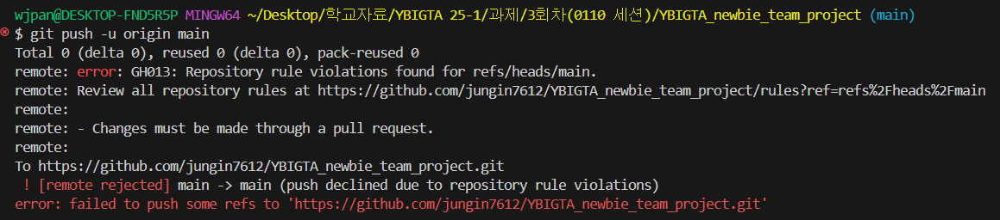

# 🛠️ 베이스라인즈 (BaseLines)팀 팀원 자기소개 🛠️

---

## 🐍 김현운  
- **학과:** 응용통계학과 23학번  
- **지원:** DA  
- **자기소개:**  
  백준을 한 문제도 풀어보지 않았던 코린이지만, 앞으로 열심히 노력하여 팀에 도움이 되고자 합니다!  
  방학 스터디에서는 **시각화**와 **교육세션 복습**을 신청했습니다.  
  - **교육세션 복습:** 첫 수업에서 느낀 어려움을 극복하고자 신청.  
  - **시각화:** 태블로와 맷플롯립(Matplotlib)을 통해 데이터와 분석 결과를 시각화하는 기술을 배우고 싶습니다.  
- **각오:** 부족하지만 열심히 공부해서 팀에 누가 되지 않도록 따라잡겠습니다!

---

## ⚾ 성우제  
- **학과:** 산업공학과 19학번  
- **지원:** DA  
- **자기소개:**  
  데이터 분석가로서의 커리어를 목표로 DA팀에 지원했습니다.  
  팀원들과 함께 성장하며 데이터 분석 역량을 키우고 싶습니다!  
  - **특이사항:** 야구를 굉장히 좋아합니다. 🧢⚾  
- **각오:** DA팀 활동을 통해 데이터 분석의 기초를 탄탄히 다지고 싶습니다.

---

## 🎸 김정인  
- **학과:** 컴퓨터과학과 24학번  
- **지원:** DE, DS (공동 1순위)  
- **자기소개:**  
  다양한 경험을 하고 싶어 DE와 DS 분야에 공동 지원했습니다.  
  - **취미:** 야구 ⚾, 축구 ⚽, 락뮤직 🎵  
- **각오:** 팀 활동을 통해 다양한 지식과 기술을 배우고, 성장의 발판을 마련하고 싶습니다.

---

### 🙌 함께 성장하는 베이스라인즈 (BaseLines)팀이 되길 기대합니다!

<div style="display: flex; justify-content: center; align-items: center; gap: 20px;">
    
    
    
    
    
</div>

# YBIGTA Newbie Team Project 실행 방법


## 설치 방법
1. **Python 버전 확인**  
   Python 3.7 이상(또는 프로젝트에서 권장하는 버전)을 사용 중인지 확인합니다.

2. **가상 환경(옵션)**  
   원활한 패키지 관리를 위해 가상 환경 사용을 권장합니다.
   ```bash
   # 가상환경 생성 예시
   python -m venv venv
   source venv/bin/activate  # Mac/Linux
   # 또는 venv\Scripts\activate  # Windows

3. **프로젝트 종속 라이브러리 설치**  
   프로젝트 루트 디렉토리(`YBIGTA_newbie_team_project`)에서 다음 명령어를 실행합니다.
   ```bash
   pip install -r requirements.txt
   ```
4. 실행 방법
   **Uvicorn을 사용한 실행**  
   가장 간단한 실행 방법은 uvicorn 명령어를 이용하는 것입니다.
   ```bash
   uvicorn app.main:app --reload --host 0.0.0.0 --port 8000
   ```
   - `app.main:app`은 `app` 폴더 내부의 `main.py`에서 FastAPI 인스턴스가 `app`이라는 이름으로 선언되어 있음을 가정합니다.
   - `--reload`는 개발 편의를 위해 코드 변경 시 자동으로 서버를 재시작합니다.
   - `--host`와 `--port`는 원하는 IP 주소와 포트를 지정할 수 있습니다(기본은 `127.0.0.1:8000`).